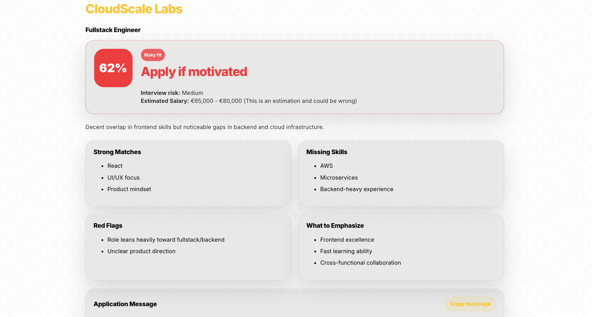
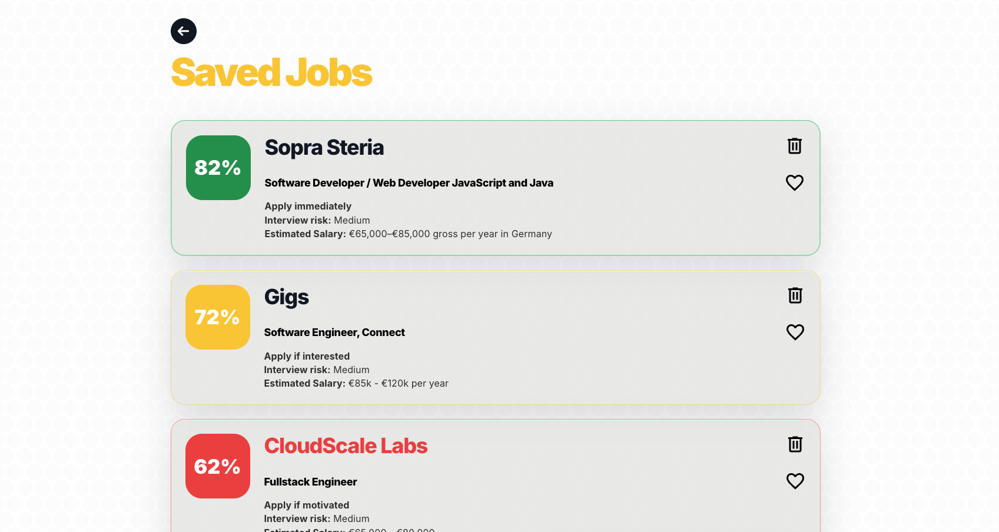

# 🐝 BeeHired

**Know before you apply.**

BeeHired is an AI-powered job fit analyzer that compares a candidate CV with a job description and returns a structured application recommendation.

It helps users understand whether a role is worth applying for by showing a match score, strong matches, missing skills, red flags, and a tailored application message.

## 🔗 Live Demo

[Try BeeHired](https://beehired-app.netlify.app/)

## 🖼 Preview

### Job fit analyzer


### AI fit analysis



### Saved jobs



## ✨ Features

- CV and job description analysis
- Match score from 0–100%
- Apply / skip recommendation
- Strong matches and missing skills
- Red flags and interview risk
- Tailored application message
- PDF CV upload
- Copy-to-clipboard application message

## 🧠 Why I built it

I built BeeHired while job hunting to solve a problem I had: quickly understanding whether a role is actually worth applying for.

The goal was to build something practical and polished.

## 🛠 Tech Stack

### Frontend

- React
- TypeScript
- Vite
- SCSS

### Backend

- Node.js
- Express
- OpenAI API

## 🧩 How it works

1. User uploads or pastes a CV
2. User pastes a job description
3. Backend sends structured data to the AI model
4. AI returns a JSON analysis
5. Frontend displays the result in a clean dashboard

## 🔐 API Key Safety

The OpenAI API key is stored only on the backend using environment variables.

The key is never exposed in frontend code or committed to GitHub.

For the public demo, the AI endpoint can be disabled or protected to prevent unwanted API usage.

## 🚀 Getting Started

### 1. Clone the repository

```bash
git clone https://github.com/dryra/beehired.git
cd beehired
```

### 2. Install frontend dependencies

```bash
cd client
npm install
npm run dev
```

### 3. Install backend dependencies

```bash
cd server
npm install
```

### 4. Create .env

```bash
OPENAI_API_KEY=your_openai_api_key_here
DEMO_MODE=false
DEMO_TOKEN=your_private_access_token
# Optional; defaults to the model already used by BeeHired
INTERVIEW_MODEL=gpt-5.5
```

### 5. Run frontend

```bash
cd client
npm run dev
```

### 6. Run Backend

```bash
cd server
npm run dev
```

### 7. Run Frontend and Backend

```bash
npm run dev
```

### Interview companion

Open the frontend with `?token=YOUR_DEMO_TOKEN` for live AI access. Both a valid
token and `DEMO_MODE=false` are required, including on localhost. Forced demo
mode disables live interview practice; the companion never presents sample
feedback as a real evaluation.

In **Saved Jobs → Application tracker**, set a job to **In progress**, then click
the assistant **Practice** button. Choose **1st round · Introductory interview**,
**2nd round · Technical interview**, or **3rd round · Soft skills interview** and
an Easy, Medium, or Hard difficulty. Each session asks ten questions, evaluates
each answer, and adapts the next question to your answers and job requirements.

New analyses retain the original job description. For older jobs, paste it into
the companion before starting; it is saved with that job. The current saved CV
is included as context. Round and difficulty sessions remain separate while the
page stays open; leaving or reloading the page clears practice history.

Coding questions use CodeMirror with syntax highlighting for JavaScript,
TypeScript, Python, Java, SQL, and C++, plus plain text for other languages.
Code is reviewed by the model and is not executed. Feedback includes a score,
strengths, improvements, and an example answer.

The backend uses structured Responses API outputs and changes interview
instructions per round/difficulty; this is contextual prompting, not model
fine-tuning. Requests use `store: false`. The description, saved CV, and current
session history are sent to OpenAI for live practice. The endpoint validates
input sizes and round types and retains the existing token-based access control.
Implementation reference: [OpenAI structured outputs](https://developers.openai.com/api/docs/guides/structured-outputs?api-mode=responses).

Run `npm test --prefix client` and `npm test --prefix server` for the UI flow and
API contract tests. Tests mock model responses and do not call OpenAI.

`VITE_API_URL` can override the API origin in either development or production.
Without it, development uses `http://localhost:3001`; production uses the same
origin (which must route `/api` to the backend).

### 👨‍💻 Author

_Ahmed Drira_:
Senior Software Engineer focused on frontend, XR, real-time systems, and AI-powered interactive applications.
